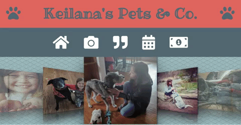
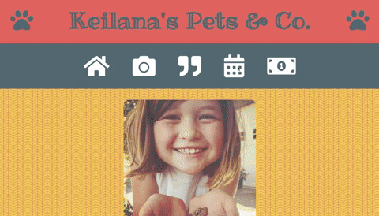

# Keilana's Pets & Co 
This web application is the vision of a 9-year-old to support her petsitting business.  It allows a user to find information about the business owner, the business itself, and the services provided through interactive elements.  It also provides users an opportunity to read and leave reviews as well as book appointments directly through the app.  

## Getting Started

* [Visit App](https://keilanapetsandco.netlify.com/)

## Built With

* [React](http://www.reactjs.org/) - The web framework used

## Author

**Kari Rosenberg** - [karibeari](https://github.com/karibeari)

## Acknowledgments

* Hat tip to my daughter, Keilana, for running such a great business and signing up as my first ever client!  

